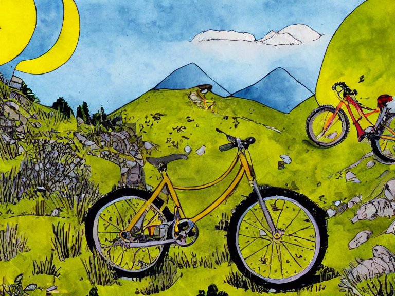
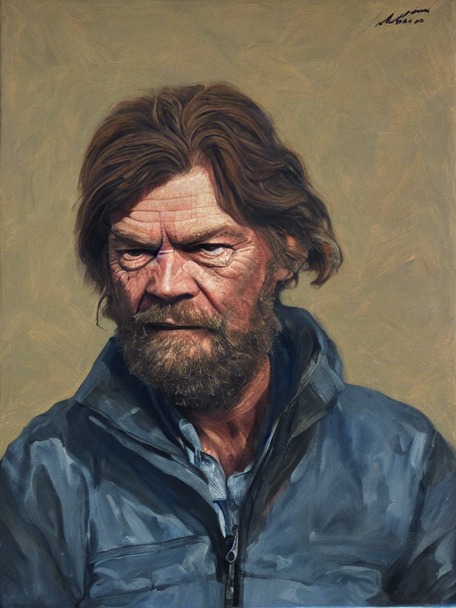

<!--
SPDX-FileCopyrightText: NOI Techpark <digital@noi.bz.it>

SPDX-License-Identifier: CC0-1.0
-->

# Stable Diffusion Webservice

(C) 2022 NOI SPA

**Changelog**:

2022-10-12 - v. 1.00 chris@1006.org  
 - added CORS header to frontend endpoints
 - increased MAX_CAPTCHA_BYTES
 - activated hCaptcha check

2022-09-19 - v. 0.95 chris@1006.org
 - first release

**Table of contents**:

<!-- TOC -->
* [Stable Diffusion Webservice](#stable-diffusion-webservice)
  * [About](#about)
  * [Building](#building)
  * [Running](#running)
  * [Endpoints for the frontend](#endpoints-for-the-frontend)
    * [/addJob](#addjob)
    * [/getJobStatus](#getjobstatus)
  * [Endpoint for the backend](#endpoint-for-the-backend)
    * [/getNextJob](#getnextjob)
    * [/setJobStatus](#setjobstatus)
  * [Resolution: choices and tips](#resolution--choices-and-tips)
    * [Examples](#examples)
<!-- TOC -->

## About

This is a webservice that implements a job queue for the
_Stable Diffusion_ demo site.

## Building

You need the Golang compiler >= 1.17 and the SQLite client.

Build the executable:

```shell
$ go build noi-sd-ws
```

Create the SQLite database file.
Run `sqlite3` with the name of the DB file to be created
(for example: `queue.db`) and read the `initialize-db.sql` script:

```shell
$ sqlite3 queue.db
SQLite version 3.39.2 2022-07-21 15:24:47
Enter ".help" for usage hints.
sqlite> .read initialize-db.sql
sqlite> .quit
```

The Webservice needs to know some secrets that for obvious
reasons are not hardcoded in the source code. These secrets
need to be written to the database. Again, use `sqlite3` to
set them:

```shell
$ sqlite3 queue.db 
SQLite version 3.39.2 2022-07-21 15:24:47
Enter ".help" for usage hints.
sqlite> update secrets set secret = '***' where kind = 'hcaptcha_secret';
sqlite> update secrets set secret = '***' where kind = 'hcaptcha_sitekey';
sqlite> update secrets set secret = '***' where kind = 'backend_secret';
sqlite> .quit
```

## Running

Deploy the executable (`noi-sd-ws`) and the database file (`queue.db`)
to any container or VM. No dependencies required.

Run it:

```shell
$ ./noi-sd-ws queue.db
```

The service will listen to the address defined in `webservices/server.go`
(see constant ADDRESS) and log to stdout.

## Deployment with Docker and Github Actions

This section is only important for NOI developers using the docker-server as infrastructure.
First create the database `queue.db` in the shared directory of the application on the docker server with the steps mentioned before.
Then the application can be deployed and executed using the Github Action.

## Endpoints for the frontend

### /addJob

A GET request to `/addJob` adds as new job to the queue.

The following parameters are required:

- **prompt**: the text prompt:  
    an english language text string of size between 1 and 500 bytes,
    only printable ASCII chars are allowed, but DE/IT chars
    (such as ä, ß, à, é, etc.) are transliterated 

- **number**: the number of images to generate:  
    an integer between 1 and 16

- **resolution**: the desired resolution:  
    a string in the form "WxH", see below for valid choices.

- **captcha**: the client response from the captcha:  
    a string that can be validated with _hCaptcha_

The request returns a JSON document (consisting of a single string value)
with status and content:

- 200 OK with the random token of the new job
- 400 Bad Request with the comma-separated error message(s) in case of missing or wrong parameters
- 500 Internal Server Error with the error message in case of some fatal failure

Following are examples using curl, also showing the HTTP response headers:

Success example:

```shell
$ curl -i 'http://127.0.0.1:9090/addJob?prompt=hello%20world&number=1&resolution=768x576&captcha=10000000-aaaa-bbbb-cccc-000000000001'
HTTP/1.1 200 OK
Content-Type: application/json
Date: Mon, 19 Sep 2022 10:07:37 GMT
Content-Length: 35

"45b825dd9eb2e9602749ac4b74b3d9d9"
```

Failure example:

```shell
$ curl -i 'http://127.0.0.1:9090/addJob?prompt=hello%20world&number=1000&resolution=768x13'                                             
HTTP/1.1 400 Bad Request
Content-Type: application/json
Date: Mon, 19 Sep 2022 10:08:09 GMT
Content-Length: 59

"number out of range, invalid resolution, missing captcha"
```

### /getJobStatus

A GET request to `/getJobStatus` returns information about a
job (identified by its token).

The following parameter is required:

- **token**: the token that identifies the job

The request returns a JSON document with status and content:

- 200 OK with an object having keys **Token**, **State** ("new", "pending" or "complete"),
  **Age** (seconds), **QueueLength** (number of new or pending jobs that are older than this one)
- 400 Bad Request with a single JSON value containing the comma-separated error message(s) in case 
  of missing or wrong parameters
- 404 Not Found and the message "token not found" in case the token could not be found
- 500 Internal Server Error with a single JSON value containing the error message in case of some
  fatal failure

Following are examples using curl, also showing the HTTP response headers:

Success example:

```shell
$ curl -i 'http://127.0.0.1:9090/getJobStatus?token=45b825dd9eb2e9602749ac4b74b3d9d9'
HTTP/1.1 200 OK
Content-Type: application/json
Date: Mon, 19 Sep 2022 10:08:38 GMT
Content-Length: 89

{"Token":"45b825dd9eb2e9602749ac4b74b3d9d9","State":"new","Age":61.618,"QueueLength":46}
```


Failure example:

```shell
$ curl -i 'http://127.0.0.1:9090/getJobStatus?token=123'                            
HTTP/1.1 400 Bad Request
Content-Type: application/json
Date: Mon, 19 Sep 2022 10:14:05 GMT
Content-Length: 23

"wrong size for token"
```

Not-found example:

```shell
$ curl -i 'http://127.0.0.1:9090/getJobStatus?token=45b825dd9eb2e9602749ac4b74000000'
HTTP/1.1 404 Not Found
Content-Type: application/json
Date: Mon, 19 Sep 2022 10:11:54 GMT
Content-Length: 18

"token not found"
```

## Endpoint for the backend

### /getNextJob

A GET request to `/getNextJob` gets the oldest job in queue that has state 'new'.

The following parameters are required:

- **secret**: the value of the secret of kind "backend_secret" in table secrets

The request returns a JSON document with status and content:

- 200 OK with an object having keys **Token**, **Number**, **Width**, **Height** and **Prompt**
- 400 Bad Request with a single JSON value containing the comma-separated error message(s) in case
  of missing or wrong parameters
- 404 Not Found and the message "no more jobs" in case there are no more jobs with state 'new'
- 500 Internal Server Error with a single JSON value containing the error message in case of some
  fatal failure

Following are examples using curl, also showing the HTTP response headers:

Success example:

```shell
$ curl -i 'http://127.0.0.1:9090/getNextJob?secret=123456'
HTTP/1.1 200 OK
Content-Type: application/json
Date: Mon, 19 Sep 2022 14:35:23 GMT
Content-Length: 104

{"Token":"375b681012543be32263ca5d3589b040","Number":1,"Width":768,"Height":576,"Prompt":"hello world"}
```

Failure example:

```shell
$ curl -i 'http://127.0.0.1:9090/getNextJob'              
HTTP/1.1 400 Bad Request
Content-Type: application/json
Date: Mon, 19 Sep 2022 14:36:25 GMT
Content-Length: 17

"missing secret"
```

No more jobs example:

```shell
$ curl -i 'http://127.0.0.1:9090/getNextJob?secret=123456'                                                       
HTTP/1.1 404 Not Found
Content-Type: application/json
Date: Mon, 19 Sep 2022 14:38:17 GMT
Content-Length: 15

"no more jobs"
```

### /setJobStatus

A GET request to `/setJobStatus` updates the state of a
job (identified by its token).

The following parameters are required:

- **token**: the token that identifies the job

- **state**: the new state:  
    new jobs can be set to "pending", pending jobs can be set to "complete",
    a backend should set a job to complete after the generated images have
    been uploaded to S3, identified by a path containing the token

- **secret**: the value of the secret of kind "backend_secret" in table secrets

The request returns a JSON document (consisting of a single string value)
with status and content:

- 200 OK with the value "ok"
- 400 Bad Request with the comma-separated error message(s) in case of missing or wrong parameters
- 404 Not Found and the message "token not found" in case the token cannot be found
- 500 Internal Server Error with the error message in case of some fatal failure

Following are examples using curl, also showing the HTTP response headers:

Success example:

```shell
$ curl -i 'http://127.0.0.1:9090/setJobStatus?token=45b825dd9eb2e9602749ac4b74b3d9d9&secret=123456&state=pending'
HTTP/1.1 200 OK
Content-Type: application/json
Date: Mon, 19 Sep 2022 10:32:03 GMT
Content-Length: 5

"ok"
```

Failure example:

```shell
$ curl -i 'http://127.0.0.1:9090/setJobStatus?token=123&state=pending' 
HTTP/1.1 400 Bad Request
Content-Type: application/json
Date: Mon, 19 Sep 2022 10:32:40 GMT
Content-Length: 39

"wrong size for token, missing secret"
```

## Resolution: choices and tips

If the resolution is much larger than the default (512x512),
Stable Diffusion tends to fill an image with multiple elements
from the prompt. There are some technical constraints as well.

After some experiments, these resolutions seem to be well suited and are accepted by /addJob:

- **1024x576** (wide landscape 16:9)

  works best for literal landscapes, 9 seconds per image on the A100

- **768x576** (landscape 4:3)

  generic 4:3 format, 6 seconds per image on the A100

- **576x768** (portrait 3:4), 

  3:4 format, for portraits, 6 seconds per image on the A100

- **576x576** (square 1:1), 

  1:1 square, like the original demos, 4 seconds per image on the A100

Stable Diffusion is very good at copying art-styles, so prompting for "watercolor" or "magazine photo" or "illustration"
is a good idea. Generally one needs to generate a few images to find an appealing one. The frontend should probably
generate 5 to 9 or so, maybe according to the selected resolution.

The user should see a few example prompts to get an idea (below are some examples, each cherry-picked from a few dozens
generate images).

### Examples


1024x576 wide landscape (16:9): "The Dolomites, high detail, watercolor."



768x576 landscape (4:3): "A yellow mountain bike, children's book illustration."



576x768 portrait (3:4): "Portrait of Reinhold Messner, oil painting."


576x576 square (1:1): "An apple on a wooden table, magazine photo."


